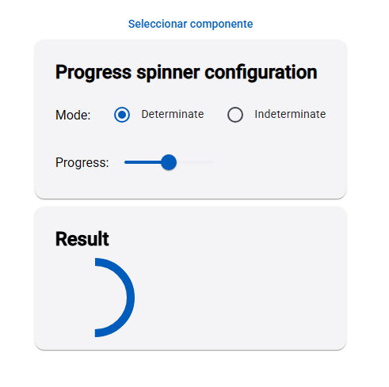

# ComponentesAn

Aplicación Angular con 15 ejercicios prácticos de Angular Material, cada uno implementado como un componente independiente y seleccionable desde un menú interactivo. Ideal para aprender y mostrar ejemplos de UI modernos y buenas prácticas en Angular.

## ¿Cómo ejecutar este proyecto?

1. **Instala las dependencias:**
   ```bash
   npm install
   ```
2. **Inicia el servidor de desarrollo:**
   ```bash
   ng serve
   ```
3. **Abre tu navegador en:**
   [http://localhost:4200/](http://localhost:4200/)

La aplicación recargará automáticamente al guardar cambios en los archivos fuente.

## ¿Cómo construir para producción o GitHub Pages?

Para generar la versión lista para producción (por ejemplo, para GitHub Pages):

```bash
ng build --output-path docs --base-href /componentesAn/
```

Esto creará la carpeta `docs` con todo lo necesario para publicar en GitHub Pages.

---


## Ejercicios y Componentes

Esta aplicación contiene 15 ejercicios interactivos, cada uno implementado como un componente Angular independiente. El menú de selección permite visualizar cada uno de ellos de forma individual.

### Menú de selección de componentes

El menú principal permite elegir qué componente visualizar.


### Lista de componentes


1. **Badge Overview**  
   Demuestra cómo usar el componente Badge de Angular Material para mostrar notificaciones o contadores sobre íconos y botones. Incluye lógica para ocultar/mostrar el badge dinámicamente.
2. **Basic Checkboxes**  
   Ejemplo de checkboxes reactivos usando formularios. Permite seleccionar toppings y muestra el estado del formulario en tiempo real.
3. **Expansion Panel**  
   Paneles expandibles que pueden contener formularios, listas o cualquier contenido. Incluye integración con datepicker y campos de texto.
4. **Mat Autocomplete**  
   Campo de texto con autocompletado, filtrando opciones a medida que el usuario escribe. Útil para búsquedas rápidas.
5. **Simple Form Field**  
   Ejemplo de campos de formulario simples, mostrando integración de select e input con Angular Material.
6. **Configurable Progress Spinner**  
   Spinner de progreso configurable en modo y valor, con controles para cambiar su comportamiento en tiempo real.
    
7. **Configurable Paginator**  
   Paginador con opciones dinámicas, permite cambiar el tamaño de página y navegar entre páginas. Incluye integración con slide-toggle.
8. **Card Overview**  
   Tarjetas de presentación de información, útiles para mostrar contenido agrupado de forma visual y atractiva.
9. **Button Toggle Selection Mode**  
   Botones de selección tipo toggle, con opciones para mostrar/ocultar indicadores de selección y modo múltiple.
10. **Slide Toggle With Forms**  
    Ejemplo de slide toggle integrado a formularios reactivos, útil para activar/desactivar opciones y validar términos.
11. **Sorting Overview**  
    Tabla con ordenamiento interactivo por columnas, ideal para mostrar y organizar datos tabulares.
12. **Stepper Vertical**  
    Formulario paso a paso vertical, guía al usuario a través de varias etapas de ingreso de datos.
13. **Tab Group**  
    Navegación por pestañas, permite mostrar diferentes contenidos en cada tab. Incluye ejemplo con video embebido.  
    
14. **Table Expandable Rows**  
    Tabla con filas expandibles para mostrar detalles adicionales de cada registro.  
    
15. **Vista inicial y menú de selección**  
    Al iniciar la app, se muestra la pantalla principal y el menú para elegir el componente a visualizar.  
    

> También puedes agregar más capturas de otros componentes, por ejemplo:
>
> 

---

## Additional Resources

For more information on using the Angular CLI, including detailed command references, visit the [Angular CLI Overview and Command Reference](https://angular.dev/tools/cli) page.
